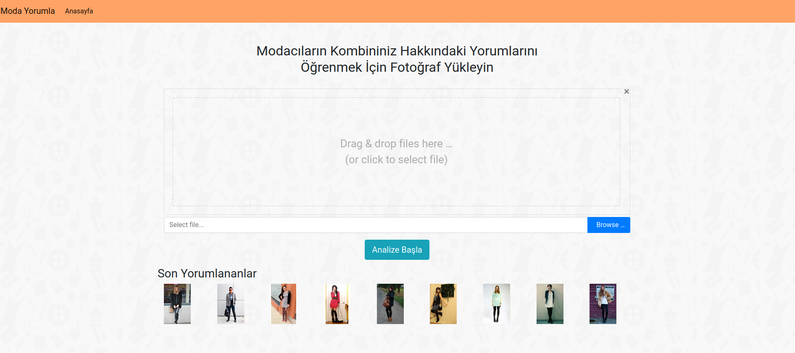
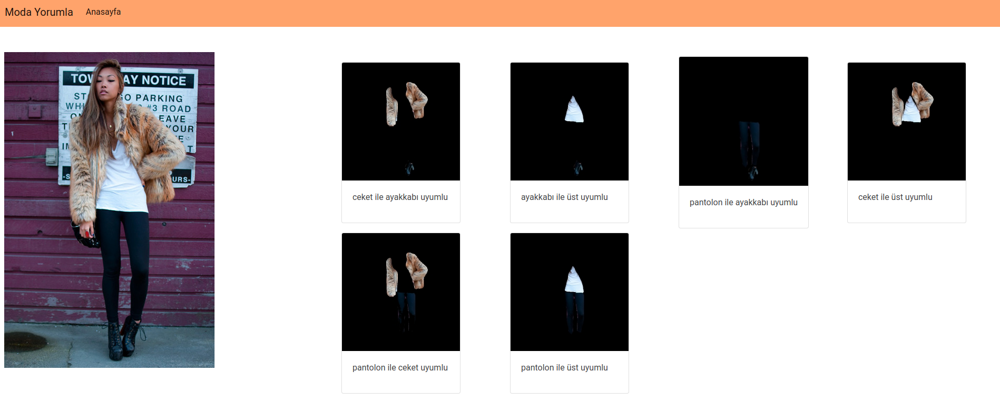

## Moda Yorumla

## Kurulum

*  [Docker Kurulumu](https://docs.docker.com/get-docker/).

* Container buradan indirilebilir: [Docker Container](https://drive.google.com/uc?id=1zACKnL9gn2ybTn-OwPkNFjRnTOfcXK0r).

* Container' ı içeri aktarma
```bash
docker import - modayorumla < modayorumla.tar
```

* Kontrol
```bash
docker images
```

## Çalıştırma

```bash
docker run -i -t -p 8000:8000 modayorumla /bin/bash
```

```bash
cd var/www/ && source python37/bin/activate && sh start.sh
```


## Ekran Görüntüleri





## Not

Ubuntu 20.04 ile yukarıdaki işlem sorunsuz gerçekleştirilmiştir.


